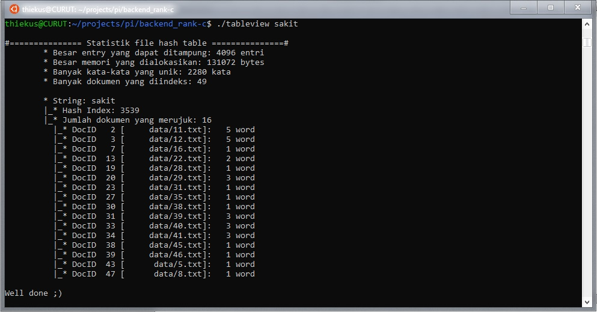
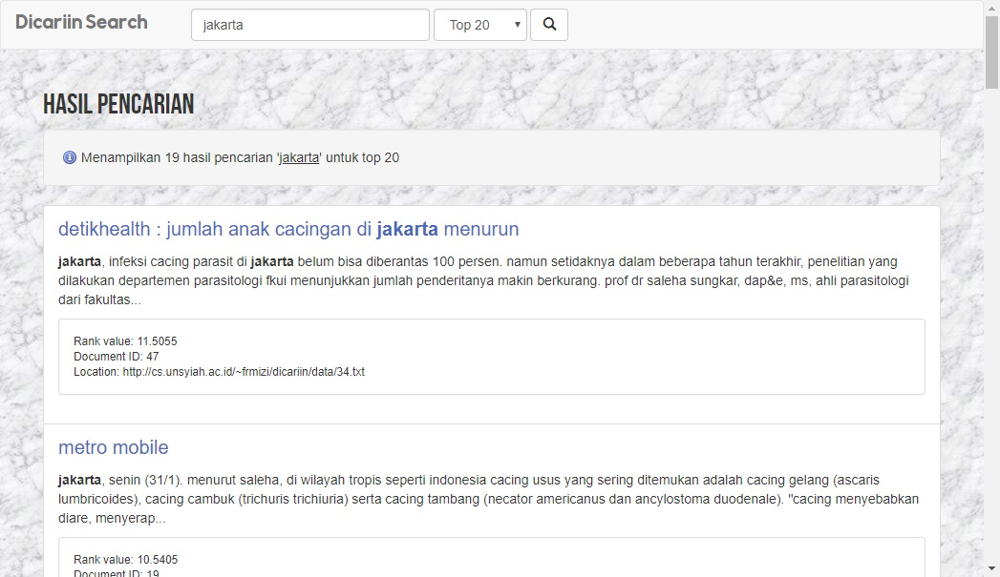

# Dicariin Search
Simple Information Retrieval C Backend and PHP Frontend

Demo at [here](http://cs.unsyiah.ac.id/~frmizi/dicariin/)

## Features
* Using hash data storage (ported from BST)
* Enhanced storage format in binary form
* Output as JSON data
* Also included `tableview` to view hierarcial information of query

* Web frontend using PHP and Bootstrap 3

## Build Guide
To build backend and tools, change your directory to backend_rank-c directory and type:

* `make index` : to build `indexdb`
* `make query` : to build plain `querydb` for query indexed data
* `make queryjson` : to make json-formated `queryjson`
* `make view` : to make hiracial view of query `tableview`

Feel free to hack and learn!
